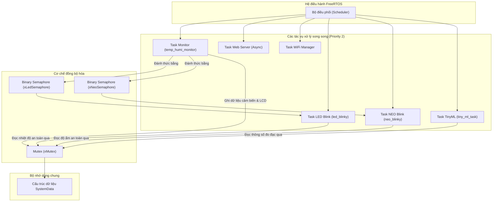
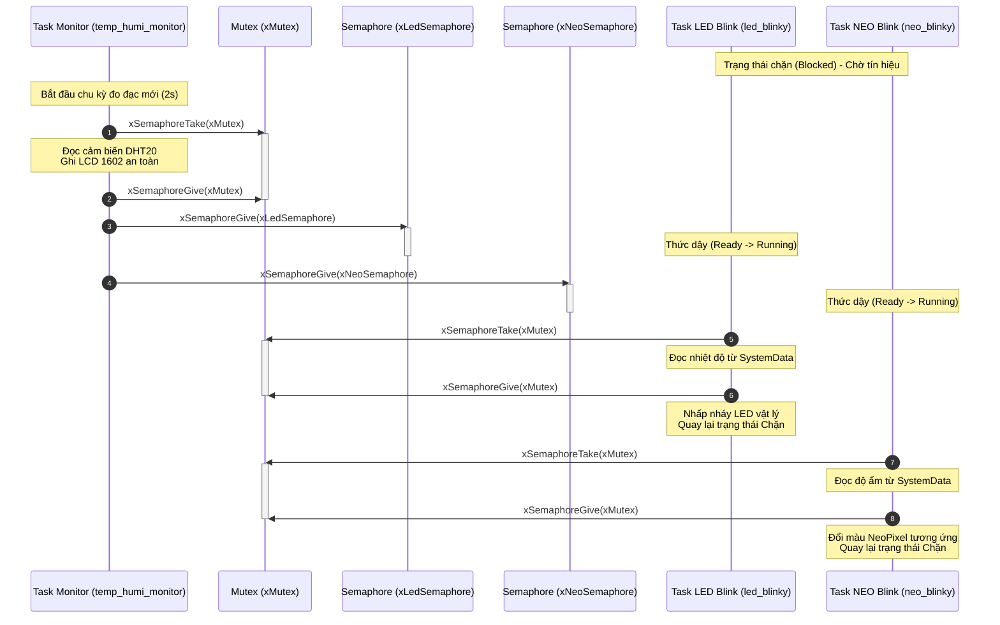
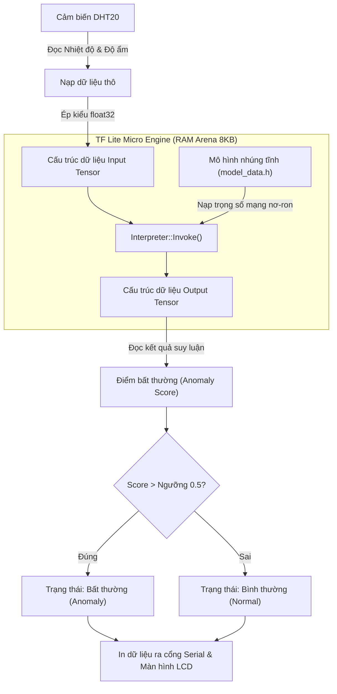
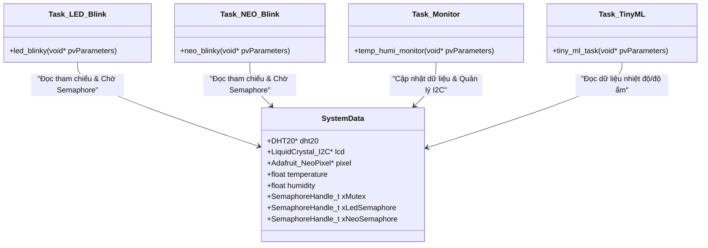
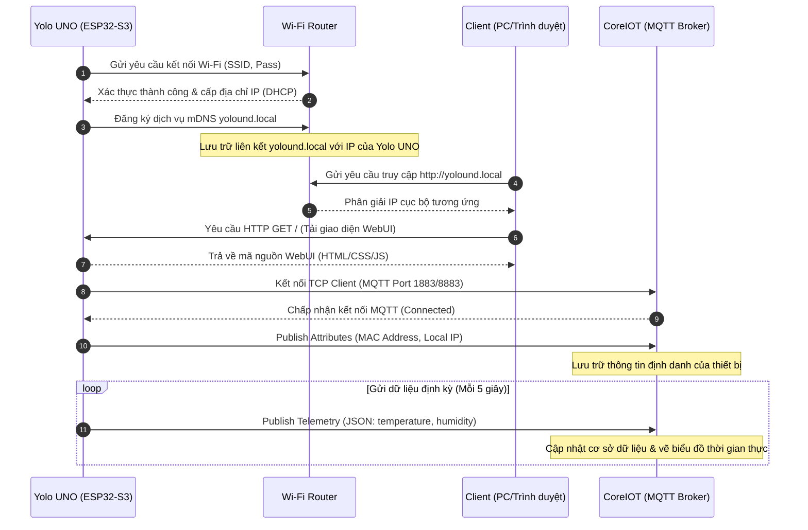
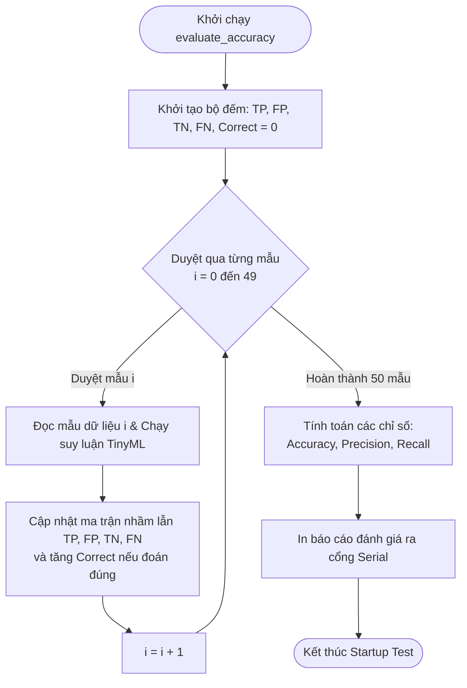

# Hướng dẫn vẽ sơ đồ và UML cho Báo cáo IoT (Chương 3 & Chương 4)

Tài liệu này chứa **hướng dẫn chi tiết** và **mã nguồn UML (dạng Mermaid)** tương ứng với 11 vị trí sơ đồ/hình ảnh đã được đánh dấu bằng khung trống (`\fbox`) trong Báo cáo LaTeX (Chương 3 và Chương 4).

---

## 🛠️ Công cụ hỗ trợ vẽ sơ đồ từ mã nguồn UML
Để chuyển đổi nhanh các đoạn mã UML trong tài liệu này thành hình ảnh chất lượng cao để chèn vào báo cáo, bạn có thể sử dụng các cách sau:

1. **Mermaid Live Editor (Khuyên dùng - Nhanh nhất):**
   * Truy cập: [mermaid.live](https://mermaid.live)
   * Copy toàn bộ nội dung khối mã `mermaid` tương ứng với sơ đồ bạn muốn vẽ.
   * Dán vào khung soạn thảo bên trái. Hình ảnh sẽ tự động được sinh ra ở khung bên phải.
   * Chọn **Download** -> **PNG** hoặc **SVG** để lưu hình ảnh về máy tính, sau đó chèn vào thư mục `SourceImage/`.

2. **Draw.io (Vẽ tay thủ công nếu muốn tùy biến cao):**
   * Truy cập: [draw.io](https://draw.io)
   * Sử dụng các hướng dẫn thiết kế bố cục (Layout), các khối hình (Shapes) được ghi chi tiết ở từng mục dưới đây để tự vẽ lại theo ý thích.
   * Draw.io cũng hỗ trợ tính năng chèn sơ đồ bằng mã thông qua menu: `Arrange -> Insert -> Advanced -> Mermaid`.

---

# CHƯƠNG 3: THIẾT KẾ HỆ THỐNG

## 1. Sơ đồ khối tổng quan kết nối phần cứng hệ thống (`fig:sys_block_diagram`)
* **Mục tiêu:** Mô tả rõ ràng phần cứng thực tế của dự án bao gồm những khối nào và chúng giao tiếp với nhau bằng giao thức vật lý gì.
* **Hướng dẫn vẽ tay (Draw.io):**
  * Đặt khối trung tâm là **ESP32-S3 (Yolo UNO)**.
  * Vẽ các mũi tên kết nối hai chiều đến cảm biến **DHT20** và **LCD 1602** thông qua đường truyền chung **I2C (SDA=11, SCL=12)**.
  * Vẽ đường kết nối một chiều từ chân GPIO đến **LED đơn onboard (GPIO 38)** và **NeoPixel RGB onboard (GPIO 18)**.
  * Vẽ đường kết nối truyền thông không dây (Wi-Fi) giữa khối Wi-Fi của ESP32-S3 với **Router**.
  * Vẽ đường liên kết từ Router đến **Web Client (Trình duyệt)** và **Đám mây CoreIOT (ThingsBoard)**.

### Mã UML (Mermaid):
```mermaid
graph TD
    subgraph Yolo_UNO ["Bo mạch Yolo UNO (ESP32-S3)"]
        MCU["ESP32-S3 MCU Core"]
        LED["LED đơn cảnh báo (GPIO 38)"]
        NEO["LED NeoPixel RGB (GPIO 18)"]
        WIFI["Module Wi-Fi"]
    end
    
    subgraph Ngoai_vi ["Ngoại vi & Cảm biến"]
        DHT20["Cảm biến DHT20 (Nhiệt độ & Độ ẩm)"]
        LCD["Màn hình LCD 1602 I2C"]
    end
    
    subgraph Mang_ngoai ["Thiết bị & Mạng ngoài"]
        PC["Máy tính giám sát (Serial/Power)"]
        Router["Wi-Fi Access Point / Router"]
        WebClient["Trình duyệt Client (WebUI)"]
        CoreIOT["Đám mây CoreIOT (ThingsBoard)"]
    end
    
    %% Kết nối phần cứng
    MCU -->|GPIO 38| LED
    MCU -->|GPIO 18| NEO
    MCU <-->|I2C: SDA=11, SCL=12| DHT20
    MCU <-->|I2C: SDA=11, SCL=12| LCD
    MCU <-->|Cáp USB Type-C| PC
    
    %% Kết nối mạng không dây
    WIFI <-->|Kết nối Wi-Fi| Router
    Router <-->|HTTP/WebSocket| WebClient
    Router <-->|MQTT (TCP/IP)| CoreIOT
```

---

## 2. Sơ đồ cấu trúc đa tác vụ song song dưới FreeRTOS (`fig:arch_rtos`)
* **Mục tiêu:** Minh họa kiến trúc phần mềm đơn bo mạch đa tác vụ (Multitasking), nơi các Task hoạt động độc lập dưới sự điều phối của FreeRTOS Scheduler.
* **Hướng dẫn vẽ tay (Draw.io):**
  * Vẽ khối **FreeRTOS Kernel/Scheduler** làm gốc điều phối.
  * Vẽ các khối đại diện cho 6 Tác vụ (Tasks): `Task LED Blink`, `Task NEO Blink`, `Task Monitor (temp_humi)`, `Task TinyML`, `Task WebServer` và `Task WiFi`.
  * Vẽ tài nguyên dùng chung là cấu trúc dữ liệu `SystemData` ở giữa.
  * Dùng các biểu tượng vòng tròn hoặc hình chữ nhật bo tròn cho **Mutex** và **Semaphores** để thể hiện liên kết trung gian đồng bộ giữa các Task.

### Mã UML (Mermaid):


---

## 3. Sơ đồ đồng bộ hóa tác vụ bằng Mutex và Semaphore (`fig:sync_diagram`)
* **Mục tiêu:** Thể hiện trình tự thời gian (Sequence) tương tác giữa Task đọc cảm biến chính và các tác vụ chấp hành phụ nhằm tránh tranh chấp tài nguyên (Race Condition).
* **Hướng dẫn vẽ tay (Draw.io):**
  * Vẽ sơ đồ trình tự (Sequence Diagram) gồm các đường dọc (Lifelines) cho: `Task Monitor`, `xMutex`, `xLedSemaphore`, `xNeoSemaphore`, `Task LED Blink`, `Task NEO Blink`.
  * Biểu diễn tiến trình `Task Monitor` chiếm Mutex -> Đọc cảm biến -> Cập nhật cấu trúc dữ liệu -> Giải phóng Mutex -> Cho Semaphore -> Thức dậy các Task phụ.

### Mã UML (Mermaid):


---

## 4. Sơ đồ luồng giao tiếp dữ liệu WebSocket (`fig:web_communication_diagram`)
* **Mục tiêu:** Minh họa cách thức Web Server trên chip ESP32-S3 giao tiếp song công thời gian thực với Web Client qua giao thức WebSocket (HTTP Port 80).
* **Hướng dẫn vẽ tay (Draw.io):**
  * Phân chia thành hai vùng: **Client (Web Browser)** và **Server (ESP32-S3)**.
  * Sử dụng các mũi tên tương tác: HTTP Request/Response cho các tệp tĩnh (`index.html`, `styles.css`, `script.js`).
  * Sử dụng mũi tên hai chiều để biểu thị đường ống **WebSocket Connection** truyền nhận tin JSON.

### Mã UML (Mermaid):
```mermaid
graph LR
    subgraph Client ["Máy khách (Web Browser)"]
        WebUI["Giao diện điều khiển WebUI"]
    end
    
    subgraph Server ["ESP32-S3 Web Server"]
        AsyncServer["ESPAsyncWebServer (Cổng 80)"]
        LFS["LittleFS (Bộ nhớ Flash tĩnh)"]
        WS["AsyncWebSocket (/ws)"]
        GPIO["Chân điều khiển GPIO (LED/Relay)"]
    end

    %% Yêu cầu tệp tĩnh ban đầu
    WebUI <-->|1. HTTP GET / /script.js /styles.css| AsyncServer
    AsyncServer <-->|2. Đọc file từ bộ nhớ| LFS
    
    %% Kết nối WebSocket
    WebUI -->|3. Thiết lập kết nối (Handshake)| WS
    
    %% Luồng truyền nhận dữ liệu thời gian thực
    WS -->|4. Broadcast JSON cảm biến định kỳ| WebUI
    WebUI -->|5. Gửi JSON lệnh điều khiển (Action/Pin/State)| WS
    
    %% Thực thi phần cứng
    WS -->|6. Thực hiện digitalWrite()| GPIO
```

---

## 5. Quy trình xử lý và suy luận học máy tại biên TinyML (`fig:tinyml_pipeline_diagram`)
* **Mục tiêu:** Thể hiện quy trình từ lúc cảm biến nhận tín hiệu vật lý đến khi mô hình TensorFlow Lite Micro thực thi suy luận ra trạng thái môi trường.
* **Hướng dẫn vẽ tay (Draw.io):**
  * Vẽ luồng tuần tự từ cảm biến -> Dữ liệu đầu vào -> Khối tiền xử lý (chuẩn hóa/ép kiểu float32) -> Interpreter của TFLite Micro -> Mảng mô hình nhúng -> Đầu ra (Anomaly Score) -> Ra quyết định cảnh báo.

### Mã UML (Mermaid):


---

## 6. Lưu đồ thuật toán quản lý cấu hình động bằng LittleFS (`fig:config_flowchart`)
* **Mục tiêu:** Chỉ rõ logic khởi động thông minh của thiết bị: tự động phát AP Mode nếu chưa có WiFi, ngược lại tự động kết nối STA Mode và chạy ứng dụng.
* **Hướng dẫn vẽ tay (Draw.io):**
  * Sử dụng các hình thoi cho câu lệnh rẽ nhánh điều kiện (If-else).
  * Vẽ hai nhánh rõ ràng: AP Mode (phát WiFi cấu hình) và STA Mode (kết nối mạng Internet và đẩy dữ liệu lên mây).

### Mã UML (Mermaid):
```mermaid
flowchart TD
    Start([Khởi động thiết bị]) --> InitLFS[Khởi tạo bộ nhớ tệp tin LittleFS]
    InitLFS --> LoadConf[Đọc cấu hình /info.dat]
    LoadConf --> CheckConf{Thông tin Wi-Fi\ncó tồn tại?}
    
    %% Nhánh AP Mode
    CheckConf -- "Không" --> StartAP[Kích hoạt Access Point AP Mode]
    StartAP --> LaunchServerAP[Chạy Web Server cấu hình cục bộ]
    LaunchServerAP --> WaitConfig[Chờ người dùng kết nối & nhập cấu hình]
    WaitConfig --> SaveConfig[Lưu thông số mới vào /info.dat]
    SaveConfig --> Restart[Gọi lệnh ESP.restart()]
    Restart --> Start
    
    %% Nhánh STA Mode
    CheckConf -- "Có" --> StartSTA[Kích hoạt Station STA Mode]
    StartSTA --> MDNS[Khởi động mDNS: yolound.local]
    MDNS --> ConnectCloud[Kết nối tới CoreIOT qua MQTT]
    ConnectCloud --> StartRTOS[Kích hoạt các Task FreeRTOS chạy ứng dụng]
    StartRTOS --> End([Thiết bị hoạt động bình thường])
```

---

# CHƯƠNG 4: HIỆN THỰC HỆ THỐNG

## 7. Sơ đồ cấu trúc dữ liệu `SystemData` và phân bổ tài nguyên tác vụ (`fig:rtos_system_data_diagram`)
* **Mục tiêu:** Thể hiện mối liên kết cấu trúc dữ liệu dùng chung (Shared Data Structure) chứa các tham chiếu ngoại vi và các biến đồng bộ được chia sẻ giữa các Task.
* **Hướng dẫn vẽ tay (Draw.io):**
  * Vẽ một lớp (Class) lớn có tên là `SystemData` chứa các thuộc tính (con trỏ cảm biến, con trỏ LCD, con trỏ LED, các biến temperature/humidity, các Semaphore/Mutex Handle).
  * Vẽ các khối tác vụ xung quanh và nối mũi tên chỉ sự phụ thuộc hoặc tham chiếu dữ liệu vào lớp `SystemData` này.

### Mã UML (Mermaid):


---

## 8. Lưu đồ hoạt động của các tác vụ quản lý ngoại vi chỉ thị cục bộ (`fig:peripheral_flowchart`)
* **Mục tiêu:** Mô tả thuật toán chi tiết và sự phối hợp giữa 3 Task phần cứng (Monitor, LED đơn, NeoPixel) hoạt động đồng bộ.
* **Hướng dẫn vẽ tay (Draw.io):**
  * Vẽ 3 luồng hoạt động song song tương ứng với 3 Task.
  * Chỉ rõ các khối khóa tài nguyên (Take Mutex/Semaphore) và mở khóa tài nguyên (Give Mutex/Semaphore).
  * Vẽ các nhánh điều khiển tương ứng với các ngưỡng logic trong code (nhiệt độ < 30, 30--35, >=35 và độ ẩm < 40, 40--70, > 70).

### Mã UML (Mermaid):
```mermaid
flowchart TD
    subgraph Monitor_Task ["Task 3: Giám sát đo đạc"]
        M1([Bắt đầu vòng lặp 2s]) --> M2[Chiếm Mutex (xMutex)]
        M2 --> M3[Đọc cảm biến DHT20 & cập nhật LCD]
        M3 --> M4[Cập nhật nhiệt độ/độ ẩm vào SystemData]
        M4 --> M5[Giải phóng Mutex (xMutex)]
        M5 --> M6[Giải phóng xLedSemaphore & xNeoSemaphore]
        M6 --> M7([Chờ 2 giây])
    end

    subgraph LED_Blink_Task ["Task 1: Cảnh báo LED đơn"]
        L1([Khởi động]) --> L2[Chờ Semaphore xLedSemaphore]
        L2 --> L3[Chiếm Mutex (xMutex)]
        L3 --> L4[Đọc nhiệt độ từ SystemData]
        L4 --> L5[Giải phóng Mutex (xMutex)]
        L5 --> L6{Ngưỡng nhiệt độ?}
        L6 -->|< 30°C| L_Slow[Chu kỳ nháy: 2000ms]
        L6 -->|30°C - 35°C| L_Med[Chu kỳ nháy: 1000ms]
        L6 -->|>= 35°C| L_Fast[Chu kỳ nháy: 200ms]
        L_Slow & L_Med & L_Fast --> L7[Thực thi nhấp nháy chân LED_GPIO]
        L7 --> L2
    end

    subgraph NEO_Blink_Task ["Task 2: Cảnh báo NeoPixel RGB"]
        N1([Khởi động]) --> N2[Chờ Semaphore xNeoSemaphore]
        N2 --> N3[Chiếm Mutex (xMutex)]
        N3 --> N4[Đọc độ ẩm từ SystemData]
        N4 --> N5[Giải phóng Mutex (xMutex)]
        N5 --> N6{Ngưỡng độ ẩm?}
        N6 -->|< 40%| N_Red[Màu Đỏ - Khô hạn]
        N6 -->|40% - 70%| N_Green[Màu Xanh lá - Lý tưởng]
        N6 -->|> 70%| N_Blue[Màu Xanh dương - Ẩm ướt]
        N_Red & N_Green & N_Blue --> N7[Cập nhật trạng thái màu lên dải LED]
        N7 --> N2
    end
```

---

## 9. Sơ đồ luồng xử lý gói tin WebSocket (`fig:websocket_message_handling_flow`)
* **Mục tiêu:** Mô tả thuật toán tiếp nhận và phân loại thông điệp JSON gửi từ client qua WebSocket để thực thi lệnh tương ứng.
* **Hướng dẫn vẽ tay (Draw.io):**
  * Vẽ khối bắt đầu bằng sự kiện nhận tin nhắn WebSocket.
  * Phân tích cú pháp JSON và dùng khối điều kiện rẽ nhánh kiểm tra giá trị của trường `"action"`.
  * Vẽ 3 nhánh xử lý: điều khiển GPIO, thay đổi Wi-Fi/Cloud, hoặc khôi phục cài đặt gốc.

### Mã UML (Mermaid):
```mermaid
flowchart TD
    Start([Sự kiện nhận dữ liệu WebSocket]) --> ReadText[Đọc chuỗi dữ liệu nhận được]
    ReadText --> ParseJSON[Phân tích cú pháp JSON bằng ArduinoJson]
    ParseJSON --> CheckAction{Kiểm tra trường action?}
    
    %% Nhánh điều khiển GPIO
    CheckAction -- "device" --> GetPin[Đọc số chân GPIO & trạng thái state]
    GetPin --> WriteGPIO[digitalWrite chân GPIO tương ứng HIGH/LOW]
    WriteGPIO --> SendAckGPIO[Gửi JSON đồng bộ trạng thái mới tới tất cả Client]
    SendAckGPIO --> End([Kết thúc xử lý])

    %% Nhánh cấu hình mạng
    CheckAction -- "wifi_change" --> GetWifi[Trích xuất SSID, Pass, Token, Server, Port]
    GetWifi --> SaveWifi[Ghi đè cấu hình mới vào tệp /info.dat qua LittleFS]
    SaveWifi --> SendAckWifi[Gửi thông báo lưu cấu hình thành công]
    SendAckWifi --> DelayRestart[Trì hoãn 1s & gọi lệnh ESP.restart()]
    DelayRestart --> End

    %% Nhánh Reset cấu hình
    CheckAction -- "reset" --> DeleteFile[Xóa file cấu hình /info.dat trong LittleFS]
    DeleteFile --> SendAckReset[Gửi thông báo khôi phục thành công]
    SendAckReset --> DelayRestart2[Trì hoãn 1s & gọi lệnh ESP.restart()]
    DelayRestart2 --> End
```

---

## 10. Sơ đồ trình tự truyền thông WiFi, mDNS và Cloud CoreIOT (`fig:cloud_sequence_diagram`)
* **Mục tiêu:** Thể hiện tiến trình và giao thức trao đổi gói tin giữa các thực thể phần cứng và máy chủ mạng để thiết lập hoạt động trực tuyến.
* **Hướng dẫn vẽ tay (Draw.io):**
  * Vẽ sơ đồ trình tự gồm 4 đường dọc (Lifelines): `Yolo UNO (ESP32-S3)`, `Wi-Fi Router`, `Client (Browser)`, `CoreIOT (ThingsBoard)`.
  * Vẽ các mũi tên truyền nhận tin nhắn theo dòng thời gian từ trên xuống dưới (đăng ký IP, đăng ký tên miền mDNS yolound.local, bắt tay TCP, đẩy dữ liệu Attributes và gửi chuỗi Telemetry định kỳ).

### Mã UML (Mermaid):


---

## 11. Lưu đồ thuật toán tiến trình tự kiểm thử TinyML khi khởi động (`fig:tinyml_startup_flowchart`)
* **Mục tiêu:** Mô tả logic chạy thử nghiệm đánh giá chất lượng mô hình phân loại trên 50 mẫu tĩnh ngay khi thiết bị vừa boot để tính các thông số Accuracy, Precision, Recall một cách tinh giản.
* **Hướng dẫn vẽ tay (Draw.io):**
  * Vẽ khối khởi tạo các biến tích lũy ma trận nhầm lẫn (`TP`, `TN`, `FP`, `FN`, `Correct = 0`).
  * Vẽ hình thoi kiểm tra điều kiện lặp duyệt qua 50 mẫu tĩnh (`i = 0` đến `49`).
  * Trong thân vòng lặp, vẽ hai khối đơn giản liên tiếp: Khối đọc dữ liệu và chạy suy luận TinyML (`Invoke()`) -> Khối cập nhật ma trận nhầm lẫn và biến đếm số mẫu đúng. Sau đó tăng chỉ số vòng lặp `i = i + 1` và quay lại kiểm tra điều kiện lặp.
  * Vẽ nhánh kết thúc vòng lặp để thực hiện tính toán các chỉ số (`Accuracy`, `Precision`, `Recall`) và in ra cổng Serial.

### Mã UML (Mermaid):


---
*Chúc các bạn hoàn thành bản vẽ đẹp và nộp báo cáo đạt điểm cao! Nếu có bất kỳ câu hỏi nào về thiết kế, hãy thảo luận thêm.*
